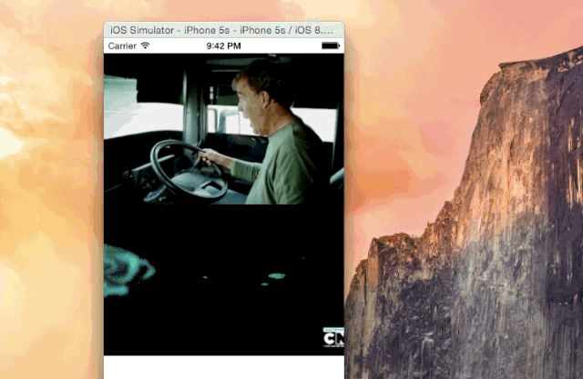

# SwiftGif [](https://developer.apple.com/swift/) [](https://github.com/Carthage/Carthage) [](http://cocoadocs.org/docsets/SwiftGifOrigin) [](https://github.com/Carthage/Carthage) [](https://travis-ci.org/bahlo/SwiftGif)

A small `UIImage` extension with gif support.



## Usage

```swift
// Don't forget to import SwiftGifOrigin first on top of your file!
import SwiftGifOrigin

// An animated UIImage
let jeremyGif = UIImage.gif(name: "jeremy")

// A UIImageView with async loading
let imageView = UIImageView()
imageView.loadGif(name: "jeremy")

// A UIImageView with async loading from asset catalog(from iOS9)
let imageView = UIImageView()
imageView.loadGif(asset: "jeremy")
```

## Installation
### CocoaPods
Install [CocoaPods](http://cocoapods.org) with the following command:

```bash
gem install cocoapods
```

Integrate SwiftGif into your Xcode project by creating a `Podfile`:

```ruby
platform :ios, '9.0'
use_frameworks!

target '<Your Target Name>' do
    pod 'SwiftGifOrigin', '~> 1.7.0'
end
```

Run `pod install` to build your dependencies.

### Carthage

Install [Carthage](https://github.com/Carthage/Carthage) with
[Homebrew](http://brew.sh/) using the following command:

```bash
brew update
brew install carthage
```

Add the following line to your `Cartfile` to add SwiftGif:

```ogdl
github "bahlo/SwiftGif" ~> 1.7.0
```

Run `carthage update` to build the framework and drag the built
`SwiftGif.framework` into your Xcode project.


## How does it work?
Easy, it does the following:

1. Find out the duration of every frame
2. Find the greatest common divisor
3. Add frames accordingly to the greatest common divisor to an array
4. Create an animated UIImage with the frames

## Testing

```
$ xcodebuild \
  -project SwiftGif.xcodeproj \
  -scheme SwiftGif \
  -sdk iphonesimulator \
  -destination "platform=iOS Simulator,name=iPhone 8" \
  build test \
  CODE_SIGNING_REQUIRED=NO CODE_SIGN_IDENTITY=""
```

# Inspiration
This project is heavily inspired by [uiimage-from-animated-gif](https://github.com/mayoff/uiimage-from-animated-gif).
Kudos to [@mayoff](https://github.com/mayoff). :thumbsup:

## License
This repository is licensed under the MIT license, more under
[LICENSE](LICENSE).
